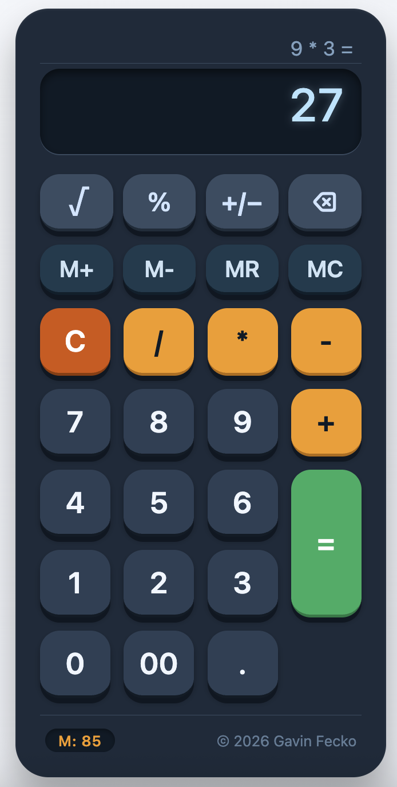
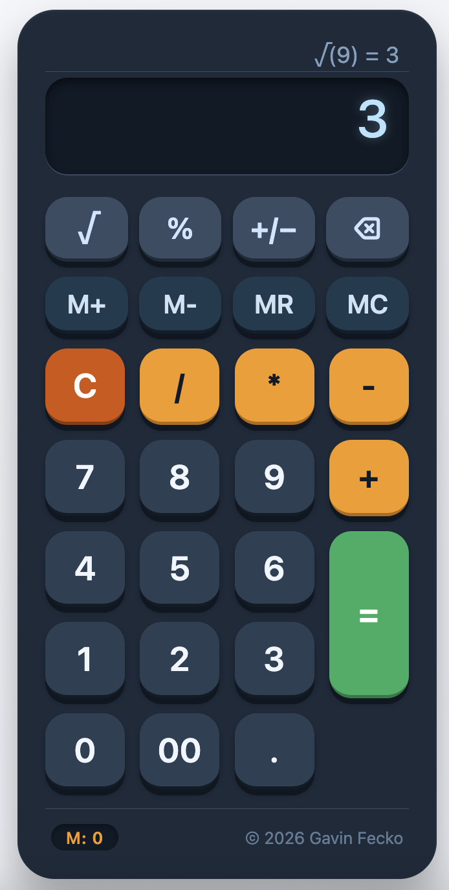

# 🧮 Calculator Portfolio Project

A fully functional calculator built from scratch using vanilla HTML, CSS, and JavaScript. I created this project to demonstrate my front-end development skills, attention to detail, and ability to write clean, maintainable code without relying on external libraries.




---

### 🚀 [Try it live](https://gavinfecko1-ship-it.github.io/calculator-portfolio/)

## 🔧 Features

### Core Calculator
- **Basic arithmetic**: addition, subtraction, multiplication, division
- **Decimal support** with proper validation (only one decimal point allowed)
- **Clear (C)** resets everything
- **Repeating equals**: pressing `=` multiple times repeats the last operation (e.g., `5 + 3 = 8`, `=` → `11`, `=` → `14`)
- **Operator replacement**: change your mind mid‑expression and the operator updates without losing your first number
- **Start with an operator**: typing `+ 5` works as `0 + 5`

### Advanced Functions
| Button | What it does |
|--------|--------------|
| **√** | Square root of the current value (negative inputs show "Error") |
| **%** | Percentage — standalone divides by 100; with an operator calculates X% of the previous operand |
| **+/−** | Toggles the sign of the current number |
| **⌫** | Backspace — deletes the last character |

### Memory Functions
| Button | Description |
|--------|-------------|
| **M+** | Adds the current display value to memory |
| **M‑** | Subtracts the current display value from memory |
| **MR** | Recalls the stored memory value |
| **MC** | Clears memory (resets to 0) |

A small indicator in the footer shows the current memory value (`M: X`).

### User Experience
- **Expression display** above the main output shows the full equation (e.g., `5 + 3 =`)
- **Keyboard support** for power users (numbers, operators, Enter for equals, Escape/C for clear, Backspace, and shortcuts for advanced functions)
- **Fully responsive** — works on desktop, tablet, and mobile
- **Accessible** — includes `aria-label` attributes and visible focus rings

---

## 🛠️ Tech Stack

| Layer | Technology |
|-------|------------|
| Structure | HTML5 (semantic markup) |
| Styling | CSS3 (Grid, Flexbox, custom properties, animations) |
| Logic | Vanilla JavaScript (ES6+) |

No frameworks, no dependencies — just plain HTML, CSS, and JS.

---

## 📂 Project Structure

```
Calculator-Portfolio/
├── index.html      # Main HTML file
├── style.css       # All styling
├── script.js       # Calculator logic
├── README.md       # You're reading it
├── LICENSE         # MIT License     
└── assets/         # Where to find images of the calculator
    ├── mainCalc.png
    └── sqrtCalc.png
```


---

## ▶️ How to Run

1. Download or clone the repository.
2. Open `index.html` in any modern browser.

That's it — no build step, no server needed.

---

## 🧠 Design Decisions & Code Quality

- **Separation of concerns**: HTML, CSS, and JavaScript are in separate files.
- **State management**: I use a handful of variables (`currentInput`, `previousInput`, `operator`, `shouldResetDisplay`, `expression`, `lastOperator`, `lastOperand`, `memoryValue`) to keep the calculator's state predictable.
- **Data attributes**: Buttons use `data-value`, `data-operator`, `data-action`, and `data-memory` to make event handling clean and declarative.
- **No `eval()`**: All calculations go through a safe `calculate()` function with explicit switch cases.
- **Error handling**: Division by zero and negative square roots show "Error" and reset gracefully.

### Edge Cases Considered
- Multiple decimals blocked
- `00` button behaves intuitively
- Operator pressed first is treated as `0`
- Consecutive operators replace the previous one
- Repeating equals after a calculation works as expected
- Memory persists across operations

---

## 🚧 Future Ideas (v2)

- Scientific functions: parentheses, exponentiation, trig (`sin`, `cos`, `tan`)
- Calculation history log
- Theme switcher (light/dark mode)
- Sound effects / haptic feedback toggle
- Local storage for memory value

---

## 📄 License

This project is open source and available under the [MIT License](LICENSE).

## 👤 About Me

I built this calculator as a portfolio piece to showcase clean front‑end development. If you have questions or want to connect, find me on [GitHub](https://github.com/gavinfecko1-ship-it) or [LinkedIn](https://www.linkedin.com/in/gavin-fecko).

*© 2026 Gavin Fecko*